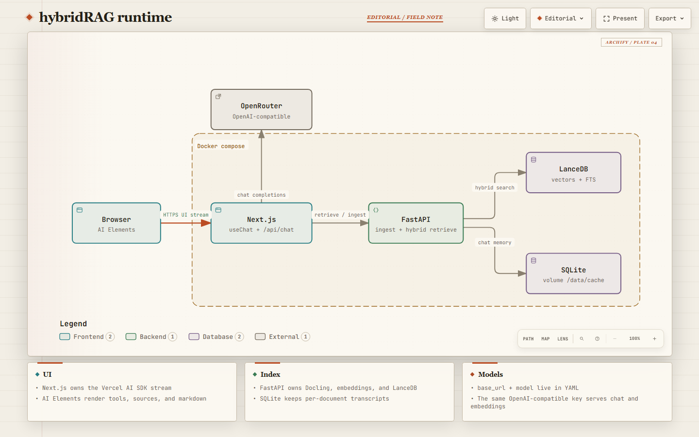
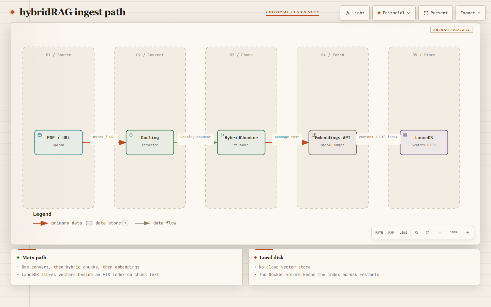
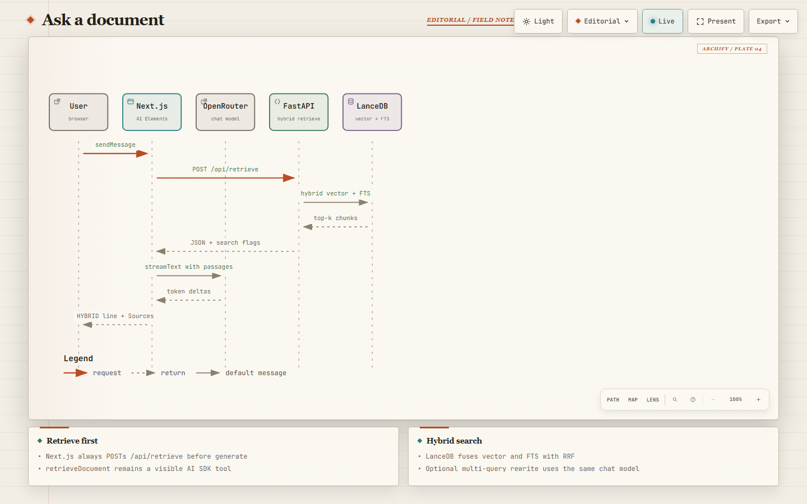

# hybridRAG

Local document Q&A with a **split stack**: Next.js streams the chat; FastAPI owns ingest, hybrid chunking, embeddings, and LanceDB. Vectors and chat memory stay on disk. The model is any **OpenAI-compatible** endpoint (OpenAI, OpenRouter, vLLM, LM Studio).

UI: [http://localhost:3000](http://localhost:3000) · chat: [http://localhost:3000/chat](http://localhost:3000/chat) · API docs: [http://127.0.0.1:8000/docs](http://127.0.0.1:8000/docs)

Interactive Archify drawings also live on the landing page (`#diagrams`). Specs are in [`docs/diagrams/`](docs/diagrams/).

## Split stack

The browser never talks to LanceDB, and FastAPI never emits the Vercel AI SDK UI-message stream.

| Layer | Owns |
| --- | --- |
| Browser | AI Elements + `useChat` |
| Next.js `POST /api/chat` | OpenAI-compatible chat via `createOpenAI({ baseURL }).chat(modelId)`, RAG as a `retrieveDocument` tool |
| FastAPI | Docling, HybridChunker, embeddings, LanceDB hybrid search, thin LangChain retrievers, SQLite memory, ingest/retrieve JSON |

```
Browser  --UI stream-->  Next.js /api/chat  --chat completions-->  LLM API
                                |
                                | POST /api/retrieve  (tool call)
                                v
                             FastAPI  --hybrid search-->  LanceDB
```

That split is the whole point: Next.js can render **Tool**, **Sources**, and streamed markdown natively. FastAPI stays a JSON index service (`POST /api/ingest/*`, `POST /api/retrieve`, `GET /api/documents`, `DELETE /api/documents`, `DELETE /api/documents/{id}`).



The architecture drawing labels the LLM box **OpenRouter**. In this repo the default `base_url` is `https://api.openai.com/v1`; point `config/model_config.yaml` (and `LLM_BASE_URL`) at OpenRouter, OpenAI, or a local server. The key must match the URL (`sk-or-…` for OpenRouter).

[Open interactive architecture](web/public/diagrams/architecture.html)

## Hybrid RAG mechanism

“Hybrid” means two things: **structure-aware chunking** at ingest, and **vector + keyword search** at retrieve (LanceDB FTS fused with nearest neighbors via RRF). FastAPI wraps those searches in thin LangChain retrievers so a later agent can reuse them as tools. Generation still happens in Next.js.

### 1. Convert

PDF, URL, or sitemap → [Docling](https://github.com/DS4SD/docling) `DocumentConverter` → a `DoclingDocument` (headings, tables, page provenance).

### 2. Hybrid chunk

[`src/processing/chunking.py`](src/processing/chunking.py) runs Docling’s `HybridChunker` with a tiktoken (`cl100k_base`) wrapper:

- split along document structure (sections, lists, tables) instead of naive character windows
- pack peer chunks up to `max_tokens` (`merge_peers=True`, default 8191 from YAML)
- keep filename / page numbers on each chunk for citations

### 3. Embed and store

[`src/rag/indexer.py`](src/rag/indexer.py) embeds passage text through the OpenAI-compatible embeddings API (`text-embedding-3-large` by default) and writes one LanceDB table per document: `text`, `vector`, `metadata.{filename, page_numbers, title}`, plus a native full-text index on `text`. On disk: `data/vectordb` (Docker volume `/data/vectordb`).



[Open interactive ingest flow](web/public/diagrams/dataflow.html)

### 4. Ask: retrieve-then-generate

Chat still streams from Next.js. FastAPI `/api/retrieve` now:

1. Optionally rewrites the question into extra keyword queries (LangChain `ChatOpenAI`, same YAML model).
2. Runs LanceDB **hybrid search** (vector + full-text, RRF rerank) and an ensemble of the vector and keyword retrievers.
3. Always prepends the first chunks of the document (title page / header).
4. Returns passages **and** `hybrid` / `fts` / `multi_query` / `queries` flags to Next.js, which stuffs the passages into the system prompt and still exposes `retrieveDocument` as a tool.

The chat console shows those flags after each question (`HYBRID · FTS · MULTI-QUERY`). FastAPI also writes the same line to `logs/app.log`. Existing tables get an FTS index on first retrieve if ingest ran before this change. Toggle `vector_db.hybrid` / `vector_db.multi_query` in [`config/model_config.yaml`](config/model_config.yaml).



[Open interactive chat sequence](web/public/diagrams/sequence.html)

## Run locally

Needs **Python 3.13**, **[uv](https://docs.astral.sh/uv/)**, **[pnpm](https://pnpm.io/)**, and an API key for chat + embeddings.

```bash
uv sync
uv run lefthook install
cp .env.example .env
# set LLM_API_KEY  (OPENAI_API_KEY still works as a FastAPI fallback)

cd web
pnpm install
cp .env.example .env.local
# same LLM_API_KEY
# FASTAPI_URL=http://127.0.0.1:8000
```

Edit `config/model_config.yaml` for `llm.base_url`, `llm.model`, and `embeddings.model`. Keep the URL and key family in sync.

**Terminal 1 — FastAPI**

```bash
uv run uvicorn api.main:app --reload --reload-dir src --reload-dir config --app-dir src --port 8000
```

Same thing: `make api`.

**Terminal 2 — Next.js**

```bash
cd web
pnpm dev
```

Same thing: `make web`.

Open [http://localhost:3000/chat](http://localhost:3000/chat), index a PDF / URL / sitemap in the press bed, then ask. You should see `retrieveDocument` run before tokens stream. **Lift** drops one plate (LanceDB table + chat memory); **Clear bed** wipes them all. To nuke the folders from the shell: `uv run python scripts/cleanup.py --yes` (restart the API afterward).

## Docker

```bash
cp .env.example .env   # LLM_API_KEY required
docker compose up --build
```

| Service | Port | Role |
| --- | --- | --- |
| `web` | 3000 | Next.js (standalone). `FASTAPI_URL=http://api:8000` |
| `api` | 8000 | FastAPI / uvicorn |

Named volumes `rag-vectordb` and `rag-cache` keep LanceDB and SQLite across restarts. Docling needs the extra system libs baked into the API image (`libgl1`, `libglib2.0-0`, `libgomp1`).

Stop with `docker compose down`. Add `-v` only if you intend to wipe the index and memory.

## Layout

```
config/                 model + logging YAML
src/core/               settings, OpenAI-compatible clients
src/rag/                embed, index, retrieve, LanceDB
src/processing/         Docling, HybridChunker, sitemap
src/memory/             SQLite transcripts
src/api/                FastAPI routes
web/                    Next.js + AI Elements
web/public/diagrams/    delivered Archify HTML
docs/diagrams/          Archify JSON + README PNGs
data/vectordb/          LanceDB (gitignored)
data/cache/             SQLite (gitignored)
logs/app.log            FastAPI retrieve / ingest log (gitignored)
```

## Tests

```bash
uv run ruff check .
uv run mypy
uv run pytest
```

Do not commit `.env` or `web/.env.local`.
